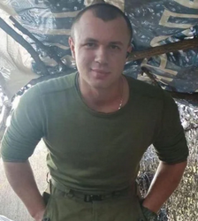
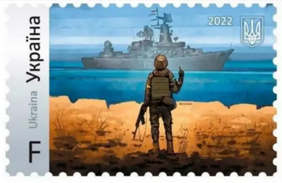

```{r setup, include=FALSE}
knitr::opts_chunk$set(echo = TRUE)
library(tidyverse)
```

###### (an open-source poem; do something with it, it's public-domain, make it your own)
<br/>

**To the heroes of Ukraine**

|      **standing opposed the march of tyranny**


<br/>



###### --------  Vitalii Volodymyrovych Skakun  ------  ------  Anastasiia Yalanskaya  ------


***

<br/>
Mother held him in her arms, whispering to him her heart

My dreams are simple, beautiful boy

Arrive there, and I’ll have accomplished my part

Spend your childhood moments happy in our home

Run in fields of wheat, they’ll soon be your own

Become a fair man for me like your father

Study maths or art, find love

Share life with another


<br/>
Little Vitalii’s fingers around her thumb wrapped 

I’ll be more, Mom, I’ll be more for you than that 

Though my days will be short, I carry courage untapped

Yes, I will be fair, be kind, and be fun

but will share my life with more than just one


<br/>
Beneath the main bridge outside Henichesk city

In a uniform with yellow tape you’ll find my torn body

When confronted with the choice, it was always to be

My nation and my lands for my life as my legacy


<br/>
My brilliant Anastasiia, her father looked into her eyes

My dream for you is to be carefree, you are my dearest prize

Travel the world, understand it by tour

Then live in the West where security’s sure

Perhaps you'll teach others, or work in AI

When you see hurt and inequity, stand afar and decry


<br/>
Her dark green eyes admired his strong chin

I love you my Dad, that’s not enough, the dream is too thin

I need to live in a world that is kind and is just

In humanity’s long struggle, I have to join in

It’s part of me, it comes from you, I want decency to win


<br/>
Near a checkpoint outside Bucha in a car with close friends

Are what remains of us and our humanitarian errands

My heart riddled with bullets, no longer a metaphor

Inside the city there are so many more


<br/>
Ukraine, sovereign Ukraine, what will your destiny be

With fist against tank you defend your democracy 

Ukraine, brave Ukraine, you fight a global fight

Because you’re the crossroads of East-West military might

Ukraine, precious Ukraine, your the fulcrum of creeds

Your allies muse armament as the Donbas recedes

Ukraine, sovereign Ukraine, what will your destiny be

Your lands at the brink of free-will and tyranny


<br/>
We watched you starve under Stalin

We watched armored convoys roll in

We watched you rise in revolution

We cheered your EuroMaidan

We saw the same scenes last century, and vowed never again

Events are carbon-copied, but we’re reluctant to lean in


<br/>
In democracy’s war, you are the front line

Your geography’s blessed and cursed at the same time

We elect our leaders to do for each country what’s best

But a partial Ukraine, *no* politician survives that test


<br/>
In a land-locked Ukraine, grain prices never go down

And cities lost to oppression make the voting public frown

A depressed populace just wants a change

No free-world politician evades that arrow’s range


<br/>
We want fearless leadership

We want rhetoric

We want raw emotion 

On the faces of those we elect


<br/>
When we look back years from now

Whose names to recall, and which to forget

We still remember Churchill, 

But Chamberlain, we have to Google it


<br/>
Scholz, Biden, Morrison, Johnson, Trudeau and Macron... take that bet

The battles aren’t yet written, the trenches aren’t yet set

We can handle hardship but not for its sake

Trade us our children's future bereft aggression and heartache


<br/>
Send air systems and modern tanks, hand the public what it wants

Without foes and champions, we see *only* the price of croissants


<br/>
Let us stand with Ukraine's heroes, fighting with burnt tires, tractors, and guns

Let us stand with their people, with those mothers holding lifeless sons

We want to share our arsenals, our morality's at stake

We want to tower over evil, for humankind's sake

The public yearns to rally, *twenty-thousand* foreign volunteers

Give us something to believe in, because what we see from you is fear


<br/>
<br/>

<!-- *** -->
<!-- <hr style="height:5px;"/> -->

<hr style="border-top: 1px solid black;"/>


To help Ukraine, this link contains a list of legitimate orgs: 
<https://www.supportukraine.co/>

***

To contact your Democratic Representative to express support for Ukraine:

| U.K. Parliament: <https://www.parliament.uk/get-involved/contact-an-mp-or-lord/> or <https://www.writetothem.com/>
| U.S. House: <https://www.house.gov/representatives/find-your-representative>
| U.S. Senate: <https://www.house.gov/representatives/find-your-representative>
| French Parliament: <https://www.assemblee-nationale.fr/dyn/vos-deputes>
| Australian Parliament: <https://www.aph.gov.au/Senators_and_Members/Guidelines_for_Contacting_Senators_and_Members>
| Canadian Parliament: <https://www.ourcommons.ca/en/contact-us>
| German Parliament: <https://www.bundestag.de/abgeordnete>

***

If nothing else, send them a poem.

***

<br/>



<br/>

